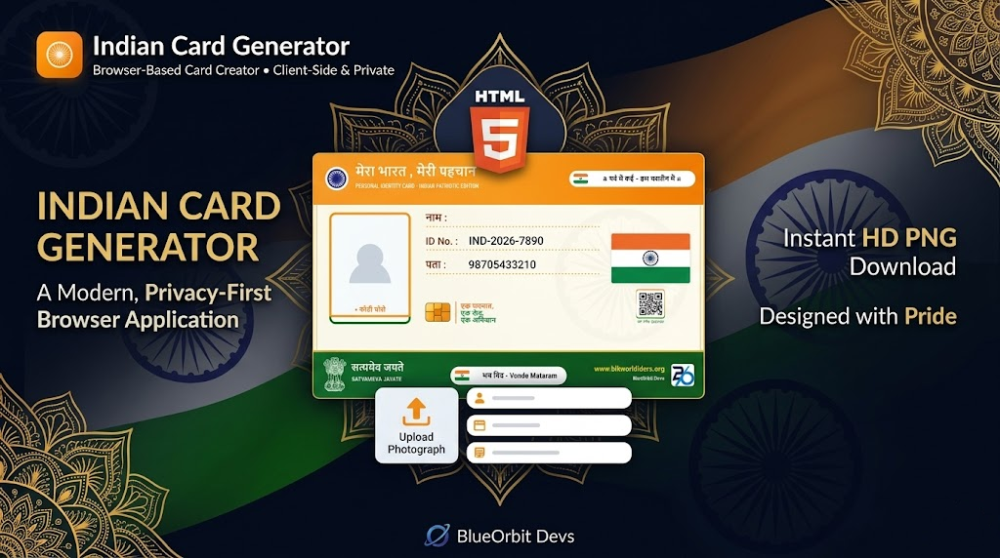
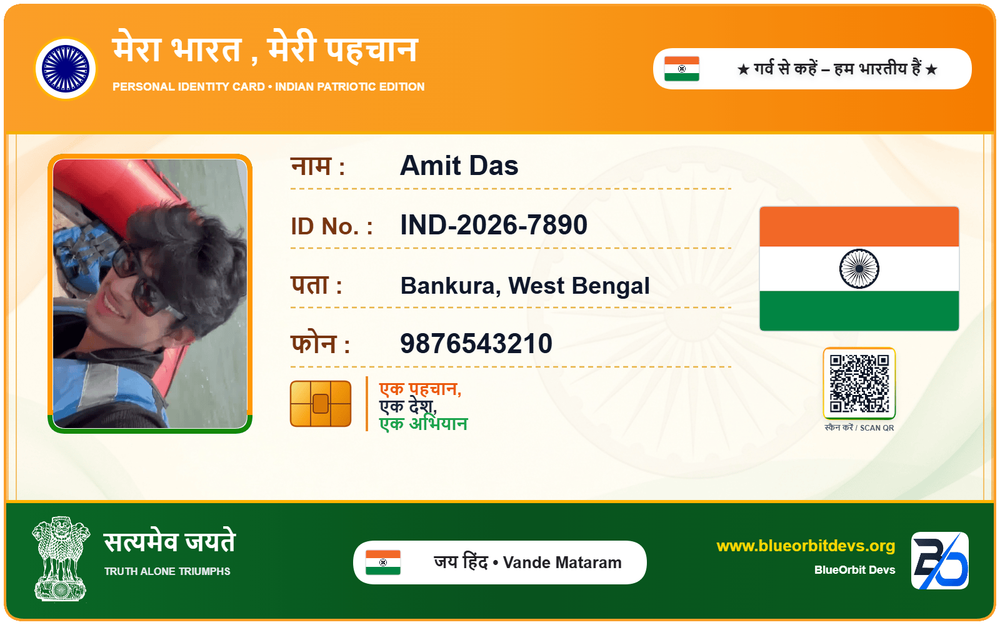
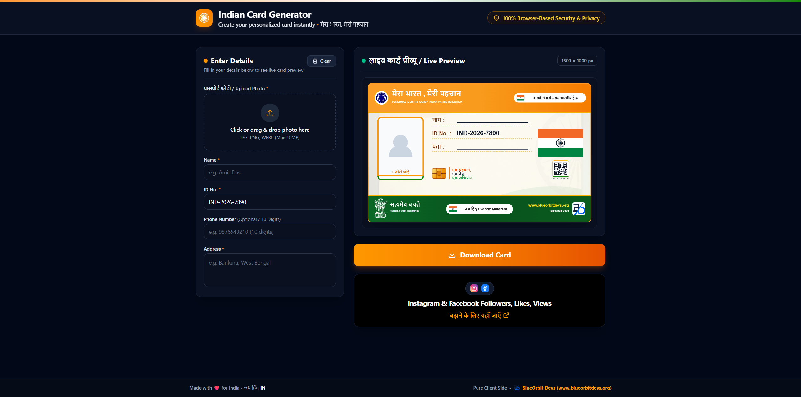

<p align="center">
  
</p>

<h1 align="center">
  🇮🇳 Indian Card Generator
</h1>

<p align="center">
  <strong>A modern, full-stack, multi-database, secure, and privacy-first browser-based card generator & online verification portal with a beautiful Indian-inspired design.</strong>
</p>

<p align="center">
  <a href="https://github.com/AmitDas4321/Indian-Card-Generator">
    
  </a>
  <a href="https://github.com/AmitDas4321/Indian-Card-Generator/network/members">
    
  </a>
  <a href="https://github.com/AmitDas4321/Indian-Card-Generator/blob/main/LICENSE">
    
  </a>
</p>

<p align="center">
  
  
  
  
  
  
  
</p>

---

# 🇮🇳 About

**Indian Card Generator** is a full-stack identity-style card creation suite and verification system designed with an Indian visual aesthetic.

It allows users to generate customizable, high-resolution identity-style cards directly in the browser with personal details, custom photo uploads, dynamic QR codes, and Ashoka Chakra decorative elements.

In addition to client-side HD rendering, it includes a robust **server-side API with HMAC-SHA256 request signing, anti-replay nonce protection, multi-database pluggable persistence (Firebase Realtime Database, MySQL, MongoDB), and an instant Online Verification Portal**.

> ⚠️ **IMPORTANT DISCLAIMER**
>
> This application is intended solely for **personal, novelty, organizational, educational, or event identity card creation**.
>
> **Generated cards are NOT official Government of India documents or identity cards**, including Aadhaar, PAN, Voter ID, Passport, Driving Licence, or any other government-issued identification.
>
> These cards have **no official or legal validity**.

---

# 🌟 Experience & Workflow

The card creation and verification process is intuitive, responsive, and secure:

```text
 📝 Enter Card Details & Upload Photo
               │
               ▼
 🇮🇳 Apply Indian-Inspired Tiranga Theme
               │
               ▼
 🔳 Generate Dynamic QR Code (${VERIFICATION_BASE_URL}/verify/:id)
               │
               ▼
 ⚡ Real-Time HTML5 Canvas Live Rendering (1600 × 1000 px)
               │
               ▼
 🔐 HMAC-SHA256 Signed API Sync to Chosen Database Provider
    (Firebase Realtime Database ⇄ MySQL ⇄ MongoDB)
               │
               ▼
 📥 Download HD PNG with Confetti Celebration
               │
               ▼
 🔍 Instant Online Verification via /verify/:id or QR Scanner
```

---

# ✨ Features

### 🗄️ Multi-Database Abstraction Layer
Switch between enterprise database providers simply by setting `DATABASE_PROVIDER`:
* 🔥 **Firebase Realtime Database** (`DATABASE_PROVIDER=firebase`): Cloud-hosted real-time persistence with memory fallback.
* 🐬 **MySQL** (`DATABASE_PROVIDER=mysql`): Connection pooling via `mysql2/promise`, automatic table migrations, parameterized prepared statements, and `LONGTEXT` Base64 image storage.
* 🍃 **MongoDB** (`DATABASE_PROVIDER=mongodb`): Connection pooling with `MongoClient`, auto-indexed unique `id` collection, and flexible document persistence.
* 🛡️ **Zero Frontend Exposure**: Database credentials, connection strings, and passwords remain strictly on the backend.

### 🎨 Design & Canvas Rendering
* 🇮🇳 **Patriotic Indian Aesthetic**: Saffron (`#FF9933`), White (`#FFFFFF`), Navy (`#060B18`), and Green (`#138808`) palette with golden ornamental accents.
* 🌀 **Ashoka Chakra Watermarks**: Authentic vector-style 24-spoke Ashoka Chakra background watermark and holographic emblems.
* 🖼️ **Photo Processing**: Local image upload, aspect-ratio preserved circular/rounded framing, and client-side processing.
* 🖨️ **1600 × 1000 px HD PNG Export**: Crisp, high-DPI HTML5 canvas rendering for crystal-clear prints and digital storage.
* 🌓 **Dark & Light Mode**: Seamless dark/light theme switching with smooth transitions.
* 🎉 **Interactive Celebration**: Canvas confetti burst upon card generation and download.

### 🔍 Verification Portal & Dynamic QR Engine
* 🌐 **Online Verification Portal (`/verify/:id`)**: Dedicated portal route to verify card authenticity, view issue timestamps, and re-download cards.
* ⚙️ **Configurable Verification URL (`VERIFICATION_BASE_URL`)**: Dynamic QR code generator pointing to your custom verification domain (supports custom workers, subdomains, and root URLs with or without trailing slashes).
* 📱 **Built-in QR Code Generation**: Instant QR rendering encoding the live verification link directly onto the card canvas.

### 🛡️ Enterprise-Grade API Security
* 🔑 **HMAC-SHA256 Request Signing**: All API requests (`/api/*`) are cryptographically signed using `X-Signature` over a canonical payload string.
* ⏱️ **Anti-Replay Protection**: Strict `X-Timestamp` drift validation (< 5 minutes) and single-use `X-Nonce` memory cache to eliminate replay attacks.
* 🔒 **Constant-Time Verification**: Timing attack prevention using `crypto.timingSafeEqual`.
* 🛡️ **API Key Validation**: Server-side validation via `X-API-Key`.
* 🚦 **IP Rate Limiting**: Built-in sliding window rate limiter (60 requests/minute per IP) with standard `X-RateLimit-*` headers.
* 🚫 **Conflict-Safe ID Allocation**: Prevents ID collisions by returning `409 Conflict` (`{"error":"ID already exists"}`) if a duplicate ID is submitted.

---

# 🖼️ Preview

## 🇮🇳 Card Preview

<p align="center">
  
</p>

## 📝 Generator Interface

<p align="center">
  
</p>

---

# 🎨 Design System

Indian Card Generator uses an Indian-inspired visual system combining patriotic colors, elegant typography, decorative patterns, and modern UI components.

### 🇮🇳 Primary Colors

```text
Deep Navy       #060B18
Dark Navy       #0B1224
Indian Saffron  #FF9933
Indian Green    #138808
Golden Accent   #D4AF37
White           #FFFFFF
```

---

# 🛠️ Tech Stack

| Technology | Purpose |
| :--- | :--- |
| **React 19** | Modern UI components and reactive state management |
| **TypeScript 5** | Strict end-to-end type safety |
| **Express 4** | Full-stack backend API server and security middlewares |
| **Multi-DB Engine** | Pluggable database abstraction for Firebase RTDB, MySQL, and MongoDB |
| **Vite 6** | Lightning-fast development server & asset bundling |
| **Tailwind CSS 4** | Utility-first responsive styling and dark mode |
| **HTML5 Canvas** | High-DPI 1600 × 1000 px card rendering engine |
| **Node.js Crypto** | HMAC-SHA256 cryptographic signing and timing-safe checks |
| **QRCode** | Dynamic QR code generation for verification URLs |
| **Canvas Confetti** | Download celebration particle animations |
| **Lucide React** | Refined interface iconography |

---

# 🔐 API & Security Architecture

### 1. Canonical Signing Format
Every request to the `/api/*` backend must supply the following headers:
* `X-API-Key`: Configured API key.
* `X-Timestamp`: Current unix timestamp in milliseconds.
* `X-Nonce`: Random unique string per request.
* `X-Signature`: Hex-encoded HMAC-SHA256 digest.

The canonical string signed with `API_SECRET_KEY` is formatted as:
```text
${METHOD}:${PATH}:${X-Timestamp}:${X-Nonce}:${REQUEST_BODY}
```

### 2. Available API Endpoints

| Method | Endpoint | Description | Auth Required |
| :--- | :--- | :--- | :---: |
| `GET` | `/api/health` | Service health & active database provider check | No |
| `GET` | `/api/next-id` | Retrieves the next preview unique ID (`IND-2026-####`) | Yes |
| `POST` | `/api/certificates` | Stores and signs a new certificate record (returns `409` on duplicate ID) | Yes |
| `GET` | `/api/certificates/:id` | Fetches a certificate record by ID for verification | Yes |
| `PUT` | `/api/certificates/:id` | Updates a certificate record | Yes |
| `DELETE` | `/api/certificates/:id` | Deletes a certificate record | Yes |

---

# ⚙️ Environment Variables

Configure these variables in your `.env` file (refer to `.env.example`):

```env
# Used for self-referential links, OAuth callbacks, and API endpoints.
APP_URL=https://example.com

# Verification Base Domain (used for QR code generation and verification links)
VERIFICATION_BASE_URL=https://indian-card-verify.blueorbitdevs.workers.dev

# Database Selection: 'firebase' | 'mysql' | 'mongodb'
DATABASE_PROVIDER=firebase

# Firebase Realtime Database
FIREBASE_DATABASE_URL=https://your-project-default-rtdb.firebaseio.com
FIREBASE_DATABASE_SECRET=your_firebase_database_secret

# MySQL
MYSQL_HOST=localhost
MYSQL_PORT=3306
MYSQL_DATABASE=tiranga_cards
MYSQL_USER=root
MYSQL_PASSWORD=your_mysql_password

# MongoDB
MONGODB_URI=mongodb://localhost:27017
MONGODB_DATABASE=tiranga_cards

# API Security (HMAC-SHA256 & API Key)
API_KEY=7f9c2e4a8b1d6f3c9a7e5b2d8f4c1a6e0d3b9c7f2a5e8d1
API_SECRET_KEY=Q8vN4xZ7pL2mK9rT5wY3cH6sJ1dF8aB0nG4uE7iP2oR9tV6x
```

---

# 📦 Installation & Quick Start

### 1. Clone Repository

```bash
git clone https://github.com/AmitDas4321/Indian-Card-Generator.git
cd Indian-Card-Generator
```

### 2. Install Dependencies

```bash
npm install
```

### 3. Setup Environment Variables

```bash
cp .env.example .env
# Edit .env and supply your credentials and DATABASE_PROVIDER
```

### 4. Start Development Server

```bash
npm run dev
```

Open your browser at:
```text
http://localhost:3000
```

---

# 🚀 Production Build & Deployment

### Build Application
```bash
npm run build
```
This compiles the Vite frontend and bundles the backend server into `dist/server.cjs`.

### Start Production Server
```bash
npm run start
```

### Available Scripts

| Command | Description |
| :--- | :--- |
| `npm run dev` | Starts the Express + Vite development server via `tsx` |
| `npm run build` | Compiles Vite client and bundles `server.ts` via `esbuild` |
| `npm run start` | Launches the compiled production server (`node dist/server.cjs`) |
| `npm run preview` | Previews the production client build |
| `npm run lint` | Runs TypeScript type checking (`tsc --noEmit`) |
| `npm run clean` | Removes build artifacts and `dist` directory |

---

# 📁 Project Structure

```text
Indian-Card-Generator/
├── src/
│   ├── components/
│   │   ├── CardForm.tsx          # Card detail input controls & validation
│   │   ├── CardPreview.tsx       # Live interactive canvas card preview
│   │   ├── DownloadButton.tsx    # HD PNG export and celebration trigger
│   │   ├── Footer.tsx            # Application footer and branding
│   │   ├── Header.tsx            # Navigation, dark mode toggle, and portal link
│   │   ├── PhotoUploader.tsx     # Local photo upload & aspect cropper
│   │   ├── SocialPromo.tsx       # Social share and community widget
│   │   └── VerificationPage.tsx  # /verify/:id Certificate Verification Portal
│   ├── services/
│   │   ├── database/             # Multi-Database Abstraction Layer
│   │   │   ├── types.ts          # Common Database Adapter interfaces
│   │   │   ├── firebase.ts       # Firebase Realtime Database Adapter
│   │   │   ├── mysql.ts          # MySQL Connection Pool Adapter & Migration
│   │   │   ├── mongodb.ts        # MongoDB MongoClient Adapter & Indexes
│   │   │   └── index.ts          # Unified Database Service Provider & ID Engine
│   │   ├── certificateService.ts # Client API connector to backend
│   │   ├── firebaseCertificate.ts# Backwards-compatible service proxy
│   │   └── localCardStorage.ts   # Offline-safe local cache manager
│   ├── utils/
│   │   ├── apiSigner.ts          # Client-side HMAC request signer
│   │   ├── cardRenderer.ts       # 1600x1000px HTML5 Canvas rendering engine
│   │   ├── confetti.ts           # Confetti celebration animations
│   │   └── validation.ts         # Input validation helpers
│   ├── App.tsx                   # Main router and view manager
│   ├── index.css                 # Tailwind CSS styles
│   ├── main.tsx                  # React DOM root
│   └── types.ts                  # TypeScript interfaces & types
├── server.ts                     # Express server, HMAC verification & DB routing
├── vite.config.ts                # Vite configuration with Tailwind CSS & env definitions
├── package.json                  # Dependencies and build scripts
└── README.md                     # Documentation
```

---

# 👨‍💻 Author

<p align="center">
  <a href="https://github.com/AmitDas4321">
    
  </a>
</p>

<p align="center">
  <b>Amit Das</b><br>
  Full Stack Developer
</p>

<p align="center">
  <a href="https://github.com/AmitDas4321">
    
  </a>
  <a href="https://amitdas.site">
    
  </a>
</p>

---

# 🌐 BlueOrbit Devs

Developed and maintained with ❤️ by **BlueOrbit Devs**.

<p align="center">
  <a href="https://www.blueorbitdevs.org">
    
  </a>
</p>

<p align="center">
  📧 <a href="mailto:blueorbitdevs@gmail.com">blueorbitdevs@gmail.com</a>
</p>

---

# ⭐ Support

If you find this project helpful, please consider giving the repository a ⭐ on GitHub!

---

# 📜 License

This project is licensed under the **MIT License**. See the [`LICENSE`](LICENSE) file for details.

---

<p align="center">
  <b>Made with ❤️ for India by <a href="https://amitdas.site">Amit Das</a> | BlueOrbit Devs</b>
</p>
